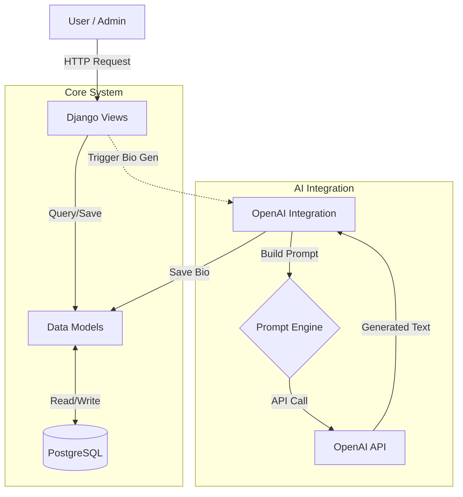

# 🚗 DriveAI: Smart Car Management System


## 📖 Overview

**DriveAI** is a robust Django-based web application designed to streamline vehicle inventory management. It leverages the power of Artificial Intelligence (OpenAI GPT-3.5) to automatically generate compelling sales bios for vehicles based on their specifications (Model, Brand, Year).

This project demonstrates a modern integration of classic web frameworks with cutting-edge AI services, providing a seamless experience for administrators and users alike.

---

## 🏗️ Architecture

The system follows a standard MVC (Model-View-Controller) architecture, enhanced with external service integrations.



---

## ✨ Key Features

- **Vehicle Management**: Comprehensive CRUD operations for managing textual and visual data of cars.
- **Brand Management**: Dynamic handling of different vehicle manufacturers.
- **🤖 AI-Powered Descriptions**: Automatic generation of marketing-grade vehicle descriptions using OpenAI's GPT models.
- **Inventory Tracking**: Real-time tracking of stock value and quantities (`CarInventory`).
- **PostgreSQL Integration**: High-performance relational database storage.
- **Media Handling**: Support for vehicle image uploads and management.

---

## 🚀 Getting Started

Follow these instructions to get the project up and running on your local machine.

### Prerequisites

- **Python 3.12+**
- **uv** (Modern Python package installer)
- **PostgreSQL** (Running locally or via Docker)

### Installation

1.  **Clone the repository**

    ```bash
    git clone https://github.com/viniciusrondon/Project-Cars
    cd 22.django_master
    ```

2.  **Install Dependencies**
    Using `uv` for blazing fast installations:

    ```powershell
    uv sync
    ```

3.  **Environment Configuration**
    Create a `.env` file in `cars/openai_api/.env` (or root depending on config) with your credentials:

    ```env
    OPENAI_API_KEY=your_openai_api_key_here
    ```

4.  **Database Setup**
    Ensure your PostgreSQL server is running and matches the settings in `settings.py`:

    ```python
    DATABASES = {
        'default': {
            'ENGINE': 'django.db.backends.postgresql',
            'NAME': 'cars',
            'USER': 'postgres',
            'PASSWORD': 'your_password',
            'HOST': 'localhost',
            'PORT': '5432',
        }
    }
    ```

5.  **Apply Migrations**

    ```powershell
    python manage.py migrate
    ```

6.  **Run the Server**
    ```powershell
    python manage.py runserver
    ```

Access the application at: `http://127.0.0.1:8000/`

---

## 🧠 Technical Highlights

### AI Integration (`openai_api/client.py`)

The system uses a dedicated client to interface with OpenAI. It constructs dynamic prompts based on vehicle attributes to ensure unique and accurate descriptions.

```python
def get_car_ai_bio(model, brand, factory_year, model_year):
    prompt = f"Create a sales bio for a {brand} {model}..."
    # ... calls OpenAI API
```

### Data Models (`cars/models.py`)

- **`Car`**: The central entity containing technical details, images, and the AI-generated bio.
- **`Brand`**: Lookup table for manufacturers.
- **`CarInventory`**: Metric aggregation for business logic.

---

## 📝 License

This project is open-source and available for educational purposes.
